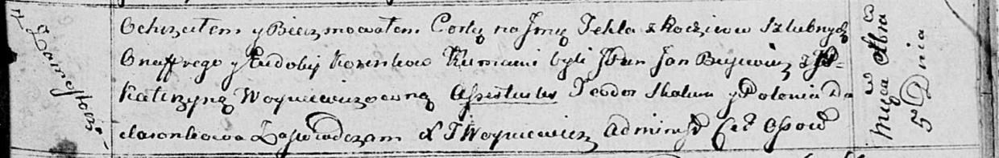

**Коренько Текля Онуфрыева (Koreńkowna Tekla)**

5 декабря 1814 г -- крещение (НИАБ 136-13-894, лист 91, №69/1814-р
(ориг)).

**НИАБ 136-13-894:** Лист 91. **Метрическая запись №69/1814-р (ориг).**

{width="6.496527777777778in"
height="1.0319083552055992in"}

Осовская Покровская церковь. 5 декабря 1814 года. Метрическая запись о
крещении.

Koreńkowna Tekla -- дочь родителей с деревни Замосточье.

Koreńko Onufry -- отец.

Koreńkowa Eudokija -- мать.

Bujewicz Jan,JP -- кум, шляхтич.

Woyciechowichowna Katerzyna, JP -- кума, шляхтянка.

Skakun Teodor -- кум.

Dudaronkowa Polonia -- кума.

Woyniewicz Tomasz -- ксёндз.
