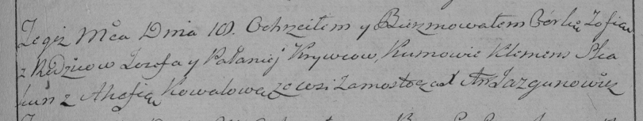

**Кривец Зофия (Krywcowna Zofija)**

18 февраля 1796 г -- крещение дочери Зофии (НИАБ 136-13-894, лист 28,
№22/1796-р (ориг)), (РГИА 823-2-18, лист 255, №8/1796-р (коп)).

**НИАБ 136-13-894:** Лист 28. **Метрическая запись №22/1796-р (ориг).**

{width="6.496527777777778in"
height="1.0453182414698163in"}

Дедиловичская Покровская церковь. 18 февраля 1796 года. Метрическая
запись о крещении.

Krywcowna Zofija -- дочь родителей с деревни Замосточье.

Krywieć Jozef -- отец.

Krywcowa Pałanieja -- мать.

Skakun Klemens - кум.

Kowalowa Ahafija - кума.

Jazgunowicz Antoni -- ксёндз.

**РГИА 823-2-18:** Лист 255. **Метрическая запись №8/1796-р (коп).**

{width="6.496527777777778in"
height="1.2256944444444444in"}

Дедиловичская Покровская церковь. 18 февраля 1796 года. Метрическая
запись о крещении.

Krywcowna Zofia -- дочь родителей с деревни Замосточье.

Krywiec Jezef -- отец.

Krywcowa Pałanieja -- мать.

Skakun Klemens -- кум.

Kowalowa Ahafia -- кума.

Jazgunowicz Antoni -- ксёндз.
