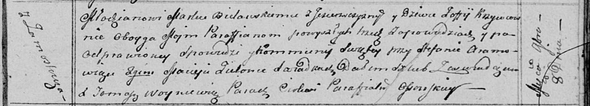

**Белявская (в девичестве Кривец) София (Bielawska Zofia z Krywcow)**

8 ноября 1813 г -- венчание с молодым Маркой Белявским с деревни
Озерщизна (НИАБ 136-13-920, лист 20, №19/1813-б (ориг)).

**НИАБ 136-13-920:** Лист 20. **Метрическая запись №19/1813-б (ориг).**

{width="6.496527777777778in"
height="1.1753958880139983in"}

Осовская Покровская церковь. 8 ноября 1813 года. Запись о венчании.

Bielawski Markо -- жених, молодой, парафии Осовской, с деревни
Озерщизна.

Krzywcowna Zoffija -- невеста, девка, парафии Осовской, с деревни
Замосточье.

Aramowicz Stefan -- свидетель.

Zielonka Maciey -- свидетель.

Woyniewicz Tomasz -- ксёндз.
