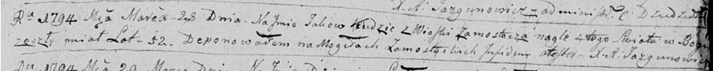

**Кудич Яков (Kudzic Jakow)**

28 марта 1794 г -- отпевание, с деревни Замосточье, умер в возрасте 52
года (родился около 1742 г) (НИАБ 136-13-919, лист 2, №19/1794-у
(ориг)).

**НИАБ 136-13-919:** Лист 2. **Метрическая запись №19/1794-у (ориг).**

{width="6.496527777777778in"
height="0.6527777777777778in"}

Дедиловичская Покровская церковь. 28 марта 1794 года. Метрическая запись
об отпевании.

Kudzic Jakow -- умерший, 52 года, с деревни Замосточье, похоронен на
кладбище деревни Замосточье.

Jazgunowicz Antoni -- ксёндз.
