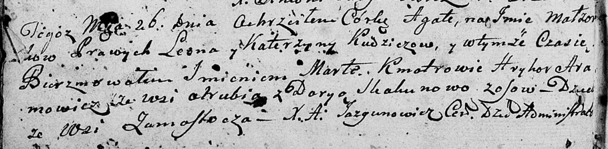
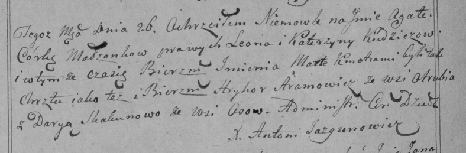
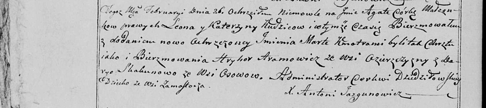

**Кудич Леон (Kudzicz Leon)**

26 февраля 1800 г -- крещение дочери Агаты Марты (НИАБ 136-13-894, лист
40об, №8/1800-р (ориг), РГИА 823-2-18, лист 274об, №8/1800-р (коп), НИАБ
136-13-949, лист 101об, №8/1800-р (коп)).

**НИАБ 136-13-894:** Лист 40об. **Метрическая запись №8/1800-р (ориг).**

Дедиловичская Покровская церковь. 26 февраля 1800 года. Метрическая
запись о крещении.

Kudziczowna Agata Marta -- дочь родителей с деревни Замосточье.

Kudzicz Leon -- отец.

Kudziczowa Katerzyna -- мать.

Aramowicz Hryhor -- кум, с деревни Отруб.

Skakunowa Darya -- кума, с деревни Осово.

Jazgunowicz Antoni -- ксёндз.

**РГИА 823-2-18:** Лист 274об. **Метрическая запись №8/1800-р (коп).**

Дедиловичская Покровская церковь. 26 февраля 1800 года. Метрическая
запись о крещении.

Kudziczowna Agata Marta -- дочь родителей с деревни \[Замосточье\].

Kudzicz Leon -- отец.

Kudziczowa Katerzyna -- мать.

Aramowicz Hryhor -- кум, с деревни Отруб.

Skakunowa Darya -- кума, с деревни Осово.

Jazgunowicz Antoni -- ксёндз.

**НИАБ 136-13-949:** Лист 101об. **Метрическая запись №8/1800-р (коп).**

(См. тж.: РГИА 823-2-18, лист 274об, №8/1800-р (коп), НИАБ 136-13-894,
лист 40об, №8/1800-р (ориг))

Дедиловичская Покровская церковь. 26 февраля 1800 года. Метрическая
запись о крещении.

Kudzicowna Agata Marta -- дочь родителей с деревни Замосточье.

Kudzic Leon -- отец.

Kudzicowa Katerzyna -- мать.

Aramowicz Hryhor -- кум, с деревни Озерщизна.

Skakunowa Darya - кума, с деревни Осово.

Jazgunowicz Antoni -- ксёндз.
