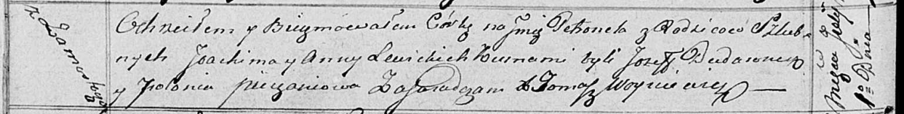

**Левицкий Мацей Яхимов (Lewicki Maciey)**

1 июля 1817 г -- крещение дочери Петронели (НИАБ 136-13-894, лист 96об,
№42/1817-р (ориг)).

**НИАБ 136-13-894:** Лист 96об. **Метрическая запись №42/1817-р
(ориг).**

Осовская Покровская церковь. 1 июля 1817 года. Метрическая запись о
крещении.

Lewicka Petronela -- дочь родителей с деревни Замосточье.

Lewicki Joakim -- отец.

Lewicka Anna -- мать.

Dudaronek Jozef -- кум.

Pieczaniowa Połonia -- кума.

Woyniewicz Tomasz -- ксёндз.
