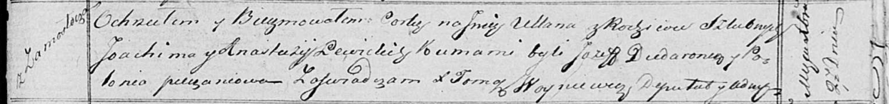

**Левицкая Ульяна Яхимова (Lewicka Ullana)**

27 декабря 1818 г -- крещение (НИАБ 136-13-894, лист 100, №47/1818-р
(ориг)).

**НИАБ 136-13-894:** Лист 100. **Метрическая запись №47/1818-р (ориг).**

Осовская Покровская церковь. 27 декабря 1818 года. Метрическая запись о
крещении.

Lewicka Ullana -- дочь родителей с деревни Замосточье.

Lewicki Joachim -- отец.

Lewicka Anastazija -- мать.

Dudaronek Jozef -- кум.

Pieczaniowa Połonia -- кума.

Woyniewicz Tomasz -- ксёндз.
