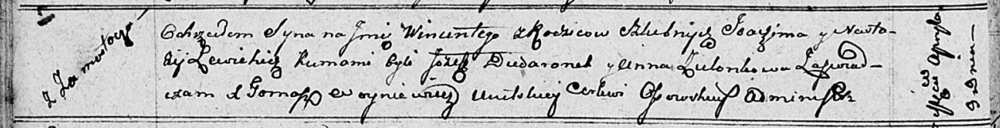

**Левицкий Мацей Яхимов (Lewicki Maciey)**

10 мая 1812 г -- крещение (НИАБ 136-13-894, лист 84об, №26/1812-р
(ориг)).

**НИАБ 136-13-894:** Лист 80об. **Метрическая запись №17/1811-р
(ориг).**

Осовская Покровская церковь. 9 апреля 1811 года. Метрическая запись о
крещении.

Lewicki Wincenty -- сын родителей с деревни Замосточье.

Lewicki Joachim -- отец.

Lewicka Nastazya -- мать.

Dudaronek Jozef -- кум.

Zielonkowa Anna -- кума.

Woyniewicz Tomasz -- ксёндз.

**НИАБ 136-13-894:** Лист 84об. **Метрическая запись №26/1812-р
(ориг).**

Осовская Покровская церковь. 10 мая 1812 года. Метрическая запись о
крещении.

Lewicki Maciey -- сын родителей с деревни Замосточье.

Lewicki Joahim -- отец.

Lewicka Nasta -- мать.

Dudaronek Jozef -- кум.

Pieczaniowa Połonia -- кума.

Woyniewicz Tomasz -- ксёндз.
