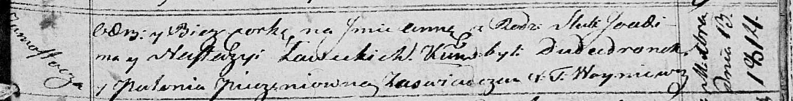

**Левицкий Яхим (Lewicki Joachim, Joahim, Joakim)**

9 апреля 1811 г -- крещение сына Винцентыя (НИАБ 136-13-894, лист 80об,
№17/1811-р (ориг)).

10 мая 1812 г -- крещение сына Мацея (НИАБ 136-13-894, лист 84об,
№26/1812-р (ориг)).

13 декабря 1814 г -- крещение дочери Анны (НИАБ 136-13-894, лист 91,
№71/1814-р (ориг)).

27 декабря 1818 г -- крещение дочери Ульяны (НИАБ 136-13-894, лист 100,
№47/1818-р (ориг)).

**НИАБ 136-13-894:** Лист 80об. **Метрическая запись №17/1811-р
(ориг).**

{width="6.496527777777778in"
height="0.8320975503062117in"}

Осовская Покровская церковь. 9 апреля 1811 года. Метрическая запись о
крещении.

Lewicki Wincenty -- сын родителей с деревни Замосточье.

Lewicki Joachim -- отец.

Lewicka Nastazya -- мать.

Dudaronek Jozef -- кум.

Zielonkowa Anna -- кума.

Woyniewicz Tomasz -- ксёндз.

**НИАБ 136-13-894:** Лист 84об. **Метрическая запись №26/1812-р
(ориг).**

{width="6.496527777777778in"
height="0.8508716097987752in"}

Осовская Покровская церковь. 10 мая 1812 года. Метрическая запись о
крещении.

Lewicki Maciey -- сын родителей с деревни Замосточье.

Lewicki Joahim -- отец.

Lewicka Nasta -- мать.

Dudaronek Jozef -- кум.

Pieczaniowa Połonia -- кума.

Woyniewicz Tomasz -- ксёндз.

**НИАБ 136-13-894:** Лист 91. **Метрическая запись №71/1814-р (ориг).**

{width="6.496527777777778in"
height="0.8314271653543307in"}

Осовская Покровская церковь. 13 декабря 1814 года. Метрическая запись о
крещении.

Lawicka Anna -- дочь родителей с деревни Замосточье.

Lawicki Joakim -- отец.

Lawicka Nastazia -- мать.

Dudaronek -- кум.

Pieczaniowna Połonia -- кума.

Woyniewicz Tomasz -- ксёндз.

**НИАБ 136-13-894:** Лист 100. **Метрическая запись №47/1818-р (ориг).**

{width="6.496527777777778in"
height="0.773092738407699in"}

Осовская Покровская церковь. 27 декабря 1818 года. Метрическая запись о
крещении.

Lewicka Ullana -- дочь родителей с деревни Замосточье.

Lewicki Joachim -- отец.

Lewicka Anastazija -- мать.

Dudaronek Jozef -- кум.

Pieczaniowa Połonia -- кума.

Woyniewicz Tomasz -- ксёндз.
