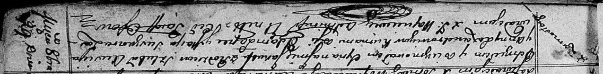

**Лександрович Якуб Авсеев (Lexandrowicz Jakub)**

29 октября 1812 г -- крещение (НИАБ 136-13-894, лист 85, №49/1812-р
(ориг)).

**НИАБ 136-13-894:** Лист 85. **Метрическая запись №49/1812-р (ориг).**

{width="6.496527777777778in"
height="0.7999136045494313in"}

Осовская Покровская церковь. 29 октября 1812 года. Метрическая запись о
крещении.

Lexandrowicz Jakub -- сын родителей с деревни Замосточье.

Lexandrowicz Ausiey -- отец.

Lexandrowiczowa Anna -- мать.

Łapeć Adam -- кум.

Suszkowa Marja -- кума.

Woyniewicz Tomasz -- ксёндз.
