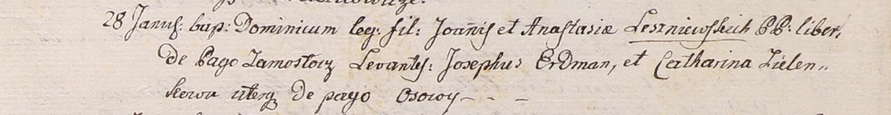

**Лешневская Анастасия (Leszniewska Anastasia)**

28 января 1801 г -- крещение сына Доминика (НИАБ 937-4-32, лист 4,
№3/1801-р).

**НИАБ 937-4-32:** Лист 4. **Метрическая запись №3/1801-р.**

{width="6.496527777777778in"
height="0.8381944444444445in"}

Дедиловичский костел Наисвятейшего Сердца Иисуса. 28 января 1801 года.
Метрическая запись о крещении.

Leszniewski Dominic -- сын вольных людей с деревни Замосточье.

Leszniewski Joann -- отец.

Leszniewska Anastasia -- мать.

Erdman Joseph -- крестный отец, с деревни Осово.

Zielonkowa Catharina -- крестная мать, с деревни Осово.

Linhart Hyacinthus -- ксёндз.
