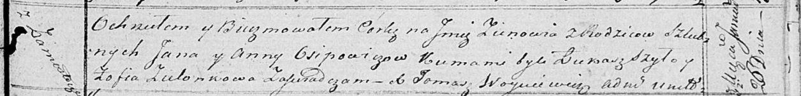

**Осипович Ян (Osipowicz Jan)**

26 января 1819 г -- крещение дочери Зеновии (НИАБ 136-13-894, лист 100,
№6/1819-р (ориг)).

**НИАБ 136-13-894:** Лист 100. **Метрическая запись №6/1819-р (ориг).**

{width="6.496527777777778in"
height="0.7911964129483815in"}

Осовская Покровская церковь. 26 января 1819 года. Метрическая запись о
крещении.

Osipowiczowna Zienowia -- дочь родителей с деревни Замосточье.

Osipowicz Jan -- отец.

Osipowiczowa Anna -- мать.

Szyło Łukasz -- кум.

Zielonkowa Zofia -- кума.

Woyniewicz Tomasz -- ксёндз.
