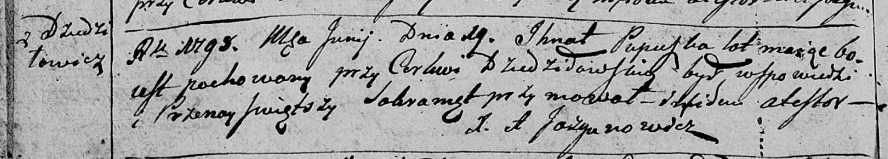

**Пупушко Игнат (Pupuszka Jhnat)**

29 июня 1798 г -- отпевание, умер в возрасте 60 лет (родился около 1738
г) (НИАБ 136-13-919, лист 7об, №10/1798-у (ориг)).

**НИАБ 136-13-894:** Лист 7об. **Метрическая запись №10/1798-у (ориг).**

{width="6.496527777777778in"
height="1.1701388888888888in"}

Дедиловичская Покровская церковь. 29 июня 1798 года. Метрическая запись
об отпевании.

Pupuszka Jhnat -- умерший, 60 лет, с деревни Замосточье, похоронен на
кладбище при церкви Дедиловичской.

Jazgunowicz Antoni -- ксёндз.
