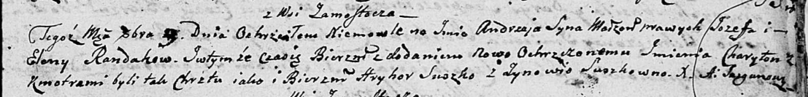

**Рандак Андрей Иосифов (Randak Andrzey Charyton)**

3 октября 1804 г -- крещение (НИАБ 136-13-894, лист 55, №44/1804-р
(ориг)).

**НИАБ 136-13-894:** Лист 55. **Метрическая запись №44/1804-р (ориг).**

{width="6.496527777777778in"
height="0.7797976815398076in"}

Дедиловичская Покровская церковь. 3 октября 1804 года. Метрическая
запись о крещении.

Randak Andrzey Charyton -- сын родителей с деревни Замосточье.

Randak Jozef -- отец.

Randakowa Elena -- мать.

Suszko Hryhor -- кум.

Suszkowna Zynowia -- кума.

Jazgunowicz Antoni -- ксёндз.
