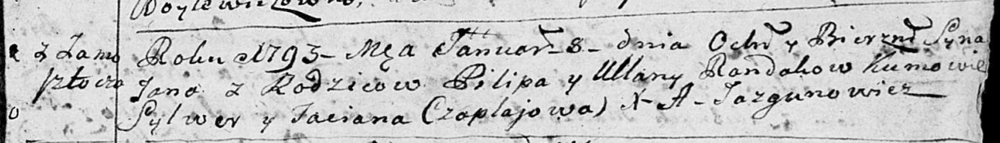
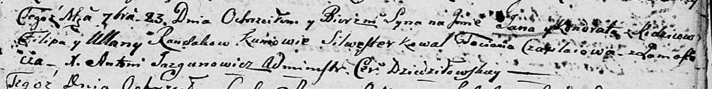

**Рандак Ульяна (Randakowa Ullana)**

8 января 1793 г -- крещение сына Яна (НИАБ 136-13-894, лист 18,
№3/1793-р (ориг)).

23 сентября 1806 г -- крещение сына Яна Кондрата младшего (НИАБ
136-13-894, лист 61, №41/1806-р (ориг)).

**НИАБ 136-13-894:** Лист 18. **Метрическая запись №3/1793-р (ориг).**

Дедиловичская Покровская церковь. 8 января 1793 года. Метрическая запись
о крещении.

Randak Jan -- сын родителей с деревни Замосточье.

Randak Pilip -- отец.

Randakowa Ullana -- мать.

Czaplay Sylwer -- кум.

Czaplajowa Taciana -- кума.

Jazgunowicz Antoni -- ксёндз.

**НИАБ 136-13-894:** Лист 61. **Метрическая запись №41/1806-р (ориг).**

Дедиловичская Покровская церковь. 23 сентября 1806 года. Метрическая
запись о крещении.

Randak Jan Kondrat -- дочь родителей с деревни Замосточье.

Randak Filip -- отец.

Randakowa Ullana -- мать.

Kawal Silwester -- кум.

Czaplaiowa Taciana -- кума.

Jazgunowicz Antoni -- ксёндз.
