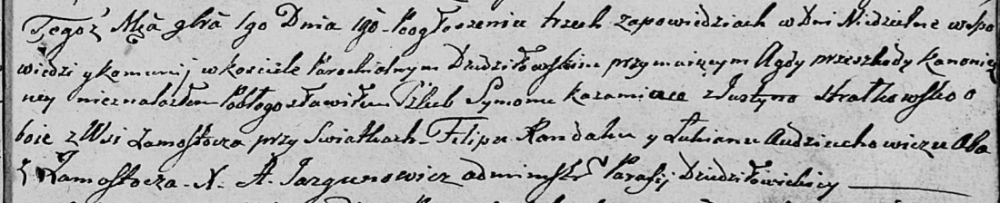

**Рандак Филип (Randak Filip)**

1 ноября 1808 г -- свидетель венчания Кожемяки Сымона с деревни
Замосточье с Юстыной Стралковской с деревни Замосточье (НИАБ 136-13-920,
лист 14, №9/1808-б (ориг)).

**НИАБ 136-13-894:** Лист 14. **Метрическая запись №9/1808-б (ориг).**

{width="6.496527777777778in"
height="1.3229068241469817in"}

Дедиловичская Покровская церковь. 1 ноября 1808 года. Метрическая запись
о венчании.

Każamiaka Symon -- жених, с деревни Замосточье.

Strałkowska Justyna -- невеста, с деревни Замосточье.

Randak Filip -- свидетель, с деревни Замосточье.

Audziuchowicz Łukjan -- свидетель, с деревни Замосточье.

Jazgunowicz Antoni -- ксёндз.
