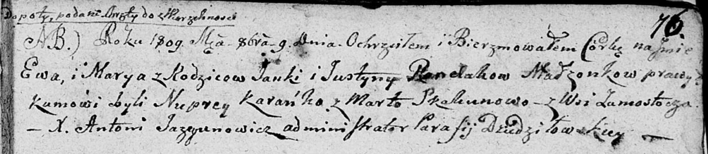

**Рандак Ева Янкова (Randakowna Ewa Marya)**

9 октября 1809 г -- крещение (НИАБ 136-13-894, лист 76, №53/1809-р
(ориг)).

**НИАБ 136-13-894:** Лист 76. **Метрическая запись №53/1809-р (ориг).**

{width="6.496527777777778in"
height="1.4194597550306212in"}

Дедиловичская Покровская церковь. 9 октября 1809 года. Метрическая
запись о крещении.

Randakowna Ewa Marya -- дочь родителей из деревни Замосточье.

Randak Janka -- отец.

Randakowa Justyna -- мать.

Karańko Nuprey -- кум.

Skakunowa Marta -- кума.

Jazgunowicz Antoni -- ксёндз.
