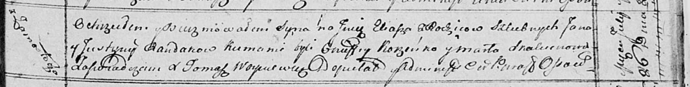

**Рандак Юстына (Randakowa Justyna)**

9 октября 1809 г -- крещение дочери Евы Марыи (НИАБ 136-13-894, лист 76,
№53/1809-р (ориг)).

26 июля 1814 г -- крещение сына Ильи (НИАБ 136-13-894, лист 90,
№47/1814-р (ориг)).

**НИАБ 136-13-894:** Лист 76. **Метрическая запись №53/1809-р (ориг).**

Дедиловичская Покровская церковь. 9 октября 1809 года. Метрическая
запись о крещении.

Randakowna Ewa Marya -- дочь родителей из деревни Замосточье.

Randak Janka -- отец.

Randakowa Justyna -- мать.

Karańko Nuprey -- кум.

Skakunowa Marta -- кума.

Jazgunowicz Antoni -- ксёндз.

**НИАБ 136-13-894:** Лист 90. **Метрическая запись №47/1814-р (ориг).**

Осовская Покровская церковь. 26 июля 1814 года. Метрическая запись о
крещении.

Randak Eliasz -- сын родителей с деревни Замосточье.

Randak Jan -- отец.

Randakowa Justyna -- мать.

Korzeńko Onufry -- кум.

Skakunowa Marta -- кума.

Woyniewicz Tomasz -- ксёндз.
