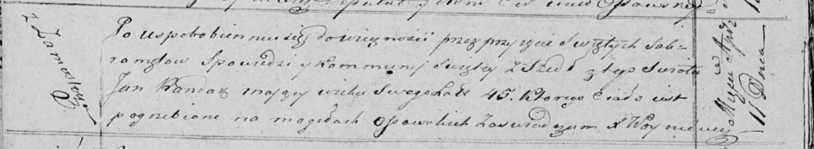

**Рандак Янка (Randak Janka, Jan)**

9 октября 1809 г -- крещение дочери Евы Марыи (НИАБ 136-13-894, лист 76,
№53/1809-р (ориг)).

26 июля 1814 г -- крещение сына Ильи (НИАБ 136-13-894, лист 90,
№47/1814-р (ориг)).

11 апреля 1821 г -- отпевание, умер в возрасте 45 лет (родился около
1776 г) (НИАБ 136-13-919, лист 34об, №4/1821-у (ориг)).

**НИАБ 136-13-894:** Лист 76. **Метрическая запись №53/1809-р (ориг).**

{width="6.496527777777778in"
height="1.4194597550306212in"}

Дедиловичская Покровская церковь. 9 октября 1809 года. Метрическая
запись о крещении.

Randakowna Ewa Marya -- дочь родителей из деревни Замосточье.

Randak Janka -- отец.

Randakowa Justyna -- мать.

Karańko Nuprey -- кум.

Skakunowa Marta -- кума.

Jazgunowicz Antoni -- ксёндз.

**НИАБ 136-13-894:** Лист 90. **Метрическая запись №47/1814-р (ориг).**

{width="6.496527777777778in"
height="0.8247222222222222in"}

Осовская Покровская церковь. 26 июля 1814 года. Метрическая запись о
крещении.

Randak Eliasz -- сын родителей с деревни Замосточье.

Randak Jan -- отец.

Randakowa Justyna -- мать.

Korzeńko Onufry -- кум.

Skakunowa Marta -- кума.

Woyniewicz Tomasz -- ксёндз.

**НИАБ 136-13-919:** Лист 34об. **Метрическая запись №4/1821-у (ориг).**

{width="6.496527777777778in"
height="1.1993055555555556in"}

Осовская униатская церковь. 11 апреля 1821 года. Метрическая запись об
отпевании.

Randak Jan -- умерший, 45 лет, с деревни Замосточье, похоронен на
кладбище деревни Осово.

Woyniewicz Tomasz -- ксёндз.
