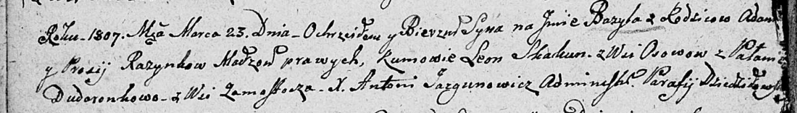

**Розынко Адам (Rozynka Adam)**

8 ноября 1803 г -- венчание с девкой Парасей Шило с деревни Замосточье
(НИАБ 136-13-920, лист 10, №12/1803-б (ориг)).

5 февраля 1805 г -- крещение дочери Настасьи Барбары (НИАБ 136-13-894,
лист 57, №16/1805-р (ориг)).

23 марта 1807 г -- крещение сына Базыля (НИАБ 136-13-894, лист 62об,
№19/1807-р (ориг)).

20 сентября 1808 г -- крещение дочери Софьи (НИАБ 136-13-894, лист 65об,
№28/1808-р (ориг)).

8 ноября 1808 г -- свидетель венчания Яна Розынки с деревни Замосточье с
Юстыной Скакун с деревни Клинники (НИАБ 136-13-920, лист 14об,
№12/1808-б (ориг)).

8 ноября 1808 г -- свидетель венчания Коренько Нупрея с деревни Осово с
девкой Евой Розынко (НИАБ 136-13-920, лист 14об, №13/1808-б (ориг)).

3 марта 1812 г -- крещение дочери Евдокии (НИАБ 136-13-894, лист 84,
№17/1812-р (ориг)).

6 июня 1815 г -- крещение дочери Тодоры (НИАБ 136-13-894, лист 92об,
№29/1815-р (ориг)).

1 декабря 1818 г -- крещение сына Клеменса (НИАБ 136-13-894, лист 99об,
№43/1818-р (ориг)).

**НИАБ 136-13-920:** Лист 10. **Метрическая запись №12/1803-б (ориг).**

{width="6.496527777777778in"
height="2.228759842519685in"}

Дедиловичская Покровская церковь. 8 ноября 1803 года. Метрическая запись
о венчании.

Rozynka Adam -- жених, молодой, с деревни Замосточье.

Szyłowa Parasia -- невеста, девка, с деревни Замосточье.

Rozynko Michaś -- свидетель.

Szyłak Janka -- свидетель.

Jazgunowicz Antoni -- ксёндз.

**НИАБ 136-13-894:** Лист 57. **Метрическая запись №16/1805-р (ориг).**

{width="6.496527777777778in"
height="1.6648654855643044in"}

Дедиловичская Покровская церковь. 5 февраля 1805 года. Метрическая
запись о крещении.

Rozynkowna Nastazya Barbara -- дочь родителей с деревни Замосточье.

Rozynko Adam -- отец.

Rozynkowa Parasia -- мать.

Skakun Chwiedor -- кум, с деревни Осовo.

Dudarowa Pałanieja -- кума, с деревни Замосточье.

Jazgunowicz Antoni -- ксёндз.

**НИАБ 136-13-894:** Лист 62об. **Метрическая запись №19/1807-р
(ориг).**

{width="6.496527777777778in"
height="0.9259678477690289in"}

Дедиловичская Покровская церковь. 23 марта 1807 года. Метрическая запись
о крещении.

Razynka Bazyl -- сын родителей с деревни \[Замосточье\].

Razynka Adam -- отец.

Razynkowa Prosia -- мать.

Skakun Leon -- кум, с деревни Осовo.

Dudaronkowa Pałanieja -- кума, с деревни Замосточье.

Jazgunowicz Antoni -- ксёндз.

**НИАБ 136-13-894:** Лист 65об. **Метрическая запись №28/1808-р
(ориг).**

{width="6.496527777777778in"
height="1.0902416885389326in"}

Дедиловичская Покровская церковь. 20 сентября 1808 года. Метрическая
запись о крещении.

Rozynkowa Zofia -- дочь родителей с деревни Замосточье.

Rozynko Adam -- отец.

Rozynkowa Paraxeda -- мать.

Skakun? Teodor -- кум.

Dudaronkowa Opołonia -- кума.

Jazgunowicz Antoni -- ксёндз.

**НИАБ 136-13-920:** Лист 14об. **Метрическая запись №12/1808-б
(ориг).**

{width="6.496527777777778in"
height="1.0547047244094487in"}

Дедиловичская Покровская церковь. 8 ноября 1808 года. Метрическая запись
о венчании.

Rozynko Jan -- жених, с деревни Замосточье.

Skakunowna Justyna -- невеста, с деревни Клинники.

Rozynka Adam -- свидетель, с деревни Замосточье.

Zielonka Macwiey -- свидетель.

Jazgunowicz Antoni -- ксёндз.

**НИАБ 136-13-920:** Лист 14об. **Метрическая запись №13/1808-б
(ориг).**

{width="6.496527777777778in"
height="1.4509744094488188in"}

Дедиловичская Покровская церковь. 8 ноября 1808 года. Метрическая запись
о венчании.

Karańko Nuprey -- жених, с деревни Осовo.

Rozynkowa Ewa -- невеста, девка.

Skakun Symon -- свидетель, с деревни Замосточье.

Rozynka Adam -- свидетель, с деревни Замосточье.

Jazgunowicz Antoni -- ксёндз.

**НИАБ 136-13-894:** Лист 84. **Метрическая запись №17/1812-р (ориг).**

{width="6.496527777777778in"
height="0.7677285651793526in"}

Осовская Покровская церковь. 3 марта 1812 года. Метрическая запись о
крещении.

Rozynkowna Ewdokija -- дочь родителей с деревни Замосточье.

Rozynko Adam -- отец.

Rozynkowa Parasia -- мать.

Skakun Kuźma -- кум.

Kowalowa Anna -- кума.

Woyniewicz Tomasz -- ксёндз.

**НИАБ 136-13-894:** Лист 92об. **Метрическая запись №29/1815-р
(ориг).**

{width="6.496527777777778in"
height="0.9407195975503062in"}

Осовская Покровская церковь. 6 июня 1815 года. Метрическая запись о
крещении.

Rozynkowna Teodora -- дочь родителей с деревни Замосточье.

Rozynko Adam -- отец.

Rozynkowa Parasia -- мать.

Zielonko Maciey -- кум.

Dudaronkowa Połonia -- кума.

Woyniewicz Tomasz -- ксёндз.

**НИАБ 136-13-894:** Лист 99об. **Метрическая запись №43/1818-р
(ориг).**

{width="6.496527777777778in"
height="0.897807305336833in"}

Осовская Покровская церковь. 1 декабря 1818 года. Метрическая запись о
крещении.

Rozynko Klemens -- сын родителей с деревни Замосточье.

Rozynko Adam -- отец.

Rozynkowa Parasia -- мать.

Zielonko Maciey -- кум.

Dudaronkowa Anna -- кума.

Woyniewicz Tomasz -- ксёндз.
