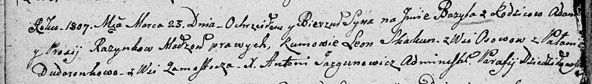

**Розынко Базыль Адамов (Rozynka Bazyl)**

23 марта 1807 г -- крещение (НИАБ 136-13-894, лист 62об, №19/1807-р
(ориг)).

**НИАБ 136-13-894:** Лист 62об. **Метрическая запись №19/1807-р
(ориг).**

{width="6.496527777777778in"
height="0.9259678477690289in"}

Дедиловичская Покровская церковь. 23 марта 1807 года. Метрическая запись
о крещении.

Razynka Bazyl -- сын родителей с деревни \[Замосточье\].

Razynka Adam -- отец.

Razynkowa Prosia -- мать.

Skakun Leon -- кум, с деревни Осовo.

Dudaronkowa Pałanieja -- кума, с деревни Замосточье.

Jazgunowicz Antoni -- ксёндз.
