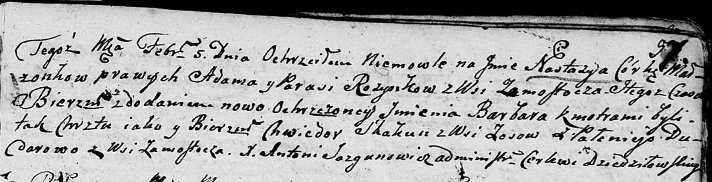

**Розынко Настасья Адамова (Rozynkowna Nastazya Barbara)**

5 февраля 1805 г -- крещение (НИАБ 136-13-894, лист 57, №16/1805-р
(ориг)).

**НИАБ 136-13-894:** Лист 57. **Метрическая запись №16/1805-р (ориг).**

Дедиловичская Покровская церковь. 5 февраля 1805 года. Метрическая
запись о крещении.

Rozynkowna Nastazya Barbara -- дочь родителей с деревни Замосточье.

Rozynko Adam -- отец.

Rozynkowa Parasia -- мать.

Skakun Chwiedor -- кум, с деревни Осовo.

Dudarowa Pałanieja -- кума, с деревни Замосточье.

Jazgunowicz Antoni -- ксёндз.
