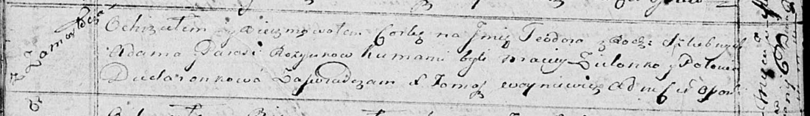
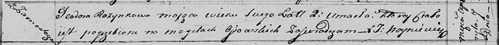

**Розынко Тодора Адамова (Rozynkowna Teodora)**

6 июня 1815 г -- крещение (НИАБ 136-13-894, лист 92об, №29/1815-р
(ориг)).

7 апреля 1817 г -- отпевание, умерла в возрасте 2 лет (НИАБ 136-13-919,
лист 30, №4/1817-у (ориг)).

**НИАБ 136-13-894:** Лист 92об. **Метрическая запись №29/1815-р
(ориг).**

Осовская Покровская церковь. 6 июня 1815 года. Метрическая запись о
крещении.

Rozynkowna Teodora -- дочь родителей с деревни Замосточье.

Rozynko Adam -- отец.

Rozynkowa Parasia -- мать.

Zielonko Maciey -- кум.

Dudaronkowa Połonia -- кума.

Woyniewicz Tomasz -- ксёндз.

**НИАБ 136-13-919:** Лист 30. **Метрическая запись №4/1817-у (ориг).**

Осовская униатская церковь. 7 апреля 1817 года. Метрическая запись об
отпевании.

Rozynkowa Teodora -- умершая, 2 года, с деревни Замосточье, похоронена
на кладбище деревни Осово.

Woyniewicz Tomasz -- ксёндз.
