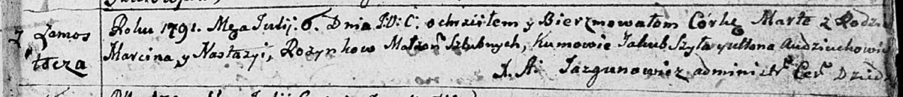
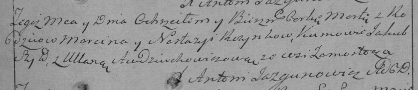

**Розынко Марта Марцинова (Rozynkowna Marta)**

6 июля 1791 г -- крещение (НИАБ 136-13-894, лист 13, №28/1791-р (ориг)),
(РГИА 823-2-18, лист 242, №15/1791-р (коп)).

**НИАБ 136-13-894:** Лист 13. **Метрическая запись №28/1791-р (ориг).**

Дедиловичская Покровская церковь. 6 июля 1791 года. Метрическая запись о
крещении.

Rozynkowna Marta -- дочь родителей с деревни Замосточье.

Rozynko Marcin -- отец.

Rozynkowa Nastazya -- мать.

Szyło Jakub -- кум.

Audziuchowiczowa Ullana - кума.

Jazgunowicz Antoni -- ксёндз.

**РГИА 823-2-18:** Лист 242. **Метрическая запись №15/1791-р (коп).**

Дедиловичская Покровская церковь. 6 июля 1791 года. Метрическая запись о
крещении.

Rozynkowna Marta -- дочь родителей с деревни Замосточье.

Rozynko Marcin -- отец.

Rozynkowa Nastazya -- мать.

Szyło Jakub -- кум.

Audziuchowiczowa Ullana - кума.

Jazgunowicz Antoni -- ксёндз.
