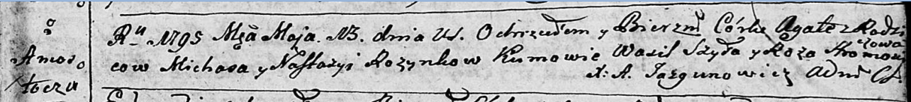

**Розынко Агата Михасёва (Rozynkowna Agata)**

13 мая 1795 г -- крещение (НИАБ 136-13-894, лист 24, №11/1795-р (ориг)).

Лист 24. **Метрическая запись №11/1795-р (ориг).**

{width="6.496527777777778in"
height="0.7328619860017498in"}

Дедиловичская Покровская церковь. 13 мая 1795 года. Метрическая запись о
крещении.

Rozynkowna Agata -- дочь родителей с деревни Замосточье.

Rozynko Michaś -- отец.

Rozynkowa Nastazya -- мать.

Szyło Wasil - кум.

Hromowiczowa Roza - кума.

Jazgunowicz Antoni -- ксёндз.
