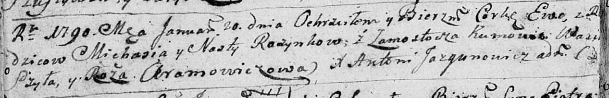
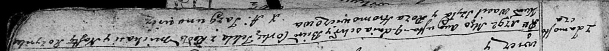
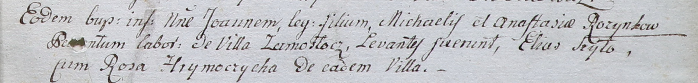

**Розынко Наста (Rozynkowa Nastazya, Nasta)**

20 января 1790 г -- крещение дочери Евы (НИАБ 136-13-894, лист 8об,
№8/1790-р (ориг)).

4 августа 1792 г -- крещение дочери Текли (НИАБ 136-13-894, лист 16,
№38/1792-р (ориг)).

13 мая 1795 г -- крещение дочери Агаты (НИАБ 136-13-894, лист 24,
№11/1795-р (ориг)).

6 апреля 1802 г -- крещение сына Иоанна (НИАБ 937-4-32, лист 6,
№9/1802-р).

**НИАБ 136-13-894:** Лист 8об. **Метрическая запись №8/1790-р (ориг).**

Дедиловичская Покровская церковь. 20 января 1790 года. Метрическая
запись о крещении.

Rozynkowna Ewa -- дочь родителей с деревни Замосточье.

Rozynko Michaś -- отец.

Rozynkowa Nasta -- мать.

Szyło Wasil - кум.

Aramowiczowa Róża - кума.

Jazgunowicz Antoni -- ксёндз.

Лист 16. **Метрическая запись №38/1792-р (ориг).**

Дедиловичская Покровская церковь. 4 августа 1792 года. Метрическая
запись о крещении.

Rozynkowna Tekla -- дочь родителей с деревни Замосточье.

Rozynka Michaś -- отец.

Rozynkowa Nasta -- мать.

Szyło Wasil - кум.

Hromowiczowa Roza - кума.

Jazgunowicz Antoni -- ксёндз.

Лист 24. **Метрическая запись №11/1795-р (ориг).**

Дедиловичская Покровская церковь. 13 мая 1795 года. Метрическая запись о
крещении.

Rozynkowna Agata -- дочь родителей с деревни Замосточье.

Rozynko Michaś -- отец.

Rozynkowa Nastazya -- мать.

Szyło Wasil - кум.

Hromowiczowa Roza - кума.

Jazgunowicz Antoni -- ксёндз.

**НИАБ 937-4-32:** Лист 6. **Метрическая запись №9/1802-р.**

Дедиловичский костел Наисвятейшего Сердца Иисуса. 6 апреля 1802 года.
Метрическая запись о крещении.

Rozynko Joann -- сын крестьян с деревни Замосточье.

Rozynko Michael -- отец.

Rozynkowa Anastasia -- мать.

Szyło Elias -- крестный отец, с деревни Замосточье?.

Hrymoczycha Rosa -- крестная мать, с деревни Замосточье.

Linhart Hyacinthus -- ксёндз.
