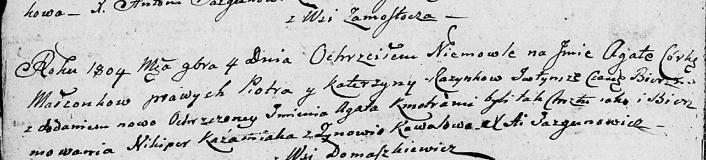

**Розынко Пётр (Rozynka Piotr)**

4 ноября 1804 г -- крещение дочери Агаты Агаты (НИАБ 136-13-894, лист
55об, №52/1804-р (ориг)).

**НИАБ 136-13-894:** Лист 55об. **Метрическая запись №52/1804-р
(ориг).**

Дедиловичская Покровская церковь. 4 ноября 1804 года. Метрическая запись
о крещении.

Rozynkowna Agata Agata -- дочь родителей с деревни Замосточье.

Rozynka Piotr -- отец.

Rozynkowa Katerzyna -- мать.

Każamiaka Nikiper -- кум.

Kowalowa Zynowia -- кума.

Jazgunowicz Antoni -- ксёндз.
