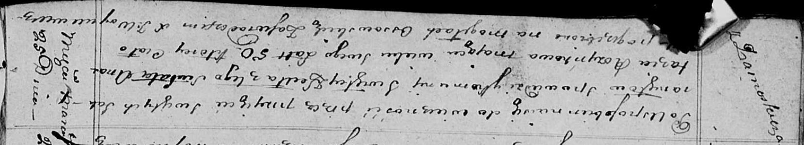

**Розынка Анастасия (Rozynkowa Anastazia)**

25 марта 1815 г -- отпевание, умерла в возрасте 50 лет (родилась около
1765 г) (НИАБ 136-13-919, лист 28об, №9/1815-у (ориг)).

**НИАБ 136-13-919:** Лист 28об. **Метрическая запись №9/1815-у (ориг).**

Осовская униатская церковь. 25 марта 1815 года. Метрическая запись об
отпевании.

Rozynkowa Anastazia -- умершая, 50 лет, с деревни Замосточье, похоронена
на кладбище деревни Осово.

Woyniewicz Tomasz -- ксёндз.
