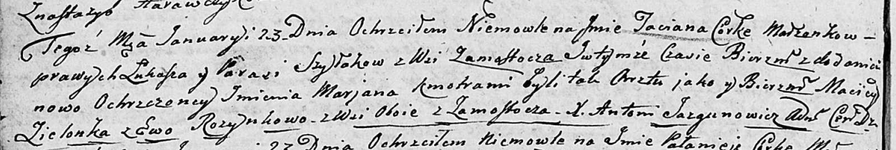

**Розынка Ева (Rozynkowa Ewa)**

23 января 1805 г -- крестная мать у Татьяны Марьяны, дочери Шилаков
Лукаша и Параси с деревни Замосточье (НИАБ 136-13-894, лист 56об,
№10/1805-р (ориг)).

3 июня 1807 г -- крестная мать у Полонеи Варвары, дочери Шилаков Лукаша
и Параси с деревни Замосточье (НИАБ 136-13-894, лист 63, №29/1807-р
(ориг)).

**НИАБ 136-13-894:** Лист 56об. **Метрическая запись №10/1805-р
(ориг).**

Дедиловичская Покровская церковь. 23 января 1805 года. Метрическая
запись о крещении.

Szyłakowna Taciana Marjana -- дочь родителей с деревни Замосточье.

Szyłak Łukasz -- отец.

Szyłakowa Parasia -- мать.

Zielonka Maciey -- кум, с деревни Замосточье.

Rozynkowa Ewa -- кума, с деревни Замосточье.

Jazgunowicz Antoni -- ксёндз.

**НИАБ 136-13-894:** Лист 63. **Метрическая запись №29/1807-р (ориг).**

Дедиловичская Покровская церковь. 3 июня 1807 года. Метрическая запись о
крещении.

Szyłakowna Pałanieja Barbara -- дочь родителей с деревни Замосточье.

Szyłak Łukasz -- отец.

Szyłakowa Parasia -- мать.

Zielonka Macwey -- кум, с деревни Замосточье.

Rozinkowa Ewa -- кума, с деревни Замосточье.

Jazgunowicz Antoni -- ксёндз.
