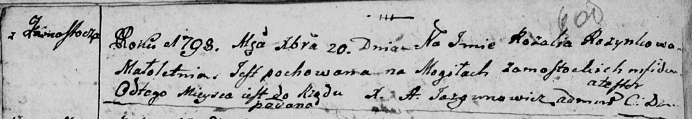

**Розынка Розалия (Rozynkowa Rozalia)**

20 декабря 1798 г -- отпевание, малолетняя (НИАБ 136-13-919, лист 8об,
№22/1798-у (ориг)).

**НИАБ 136-13-919:** Лист 8об. **Метрическая запись №22/1798-у (ориг).**

Дедиловичская Покровская церковь. 20 декабря 1798 года. Метрическая
запись об отпевании.

Rozynkowa Rozalia -- умершая, малолетняя, с деревни Замосточье,
похоронена на кладбище деревни Замосточье.

Jazgunowicz Antoni -- ксёндз.
