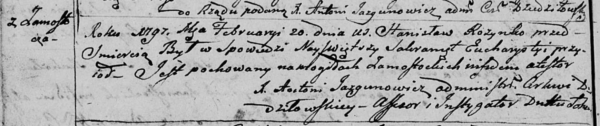

**Розынко Станислав (Rozynkа Stanisław)**

20 февраля 1798 г -- отпевание (НИАБ 136-13-920, лист 6об, №6/1799-б
(ориг)).

**НИАБ 136-13-919:** Лист 7об. **Метрическая запись №4/1798-у (ориг).**

Дедиловичская Покровская церковь. 20 февраля 1798 года. Метрическая
запись об отпевании.

Rozynko Stanisław -- умерший, с деревни Замосточье, похоронен на
кладбище деревни Замосточье.

Jazgunowicz Antoni -- ксёндз.
