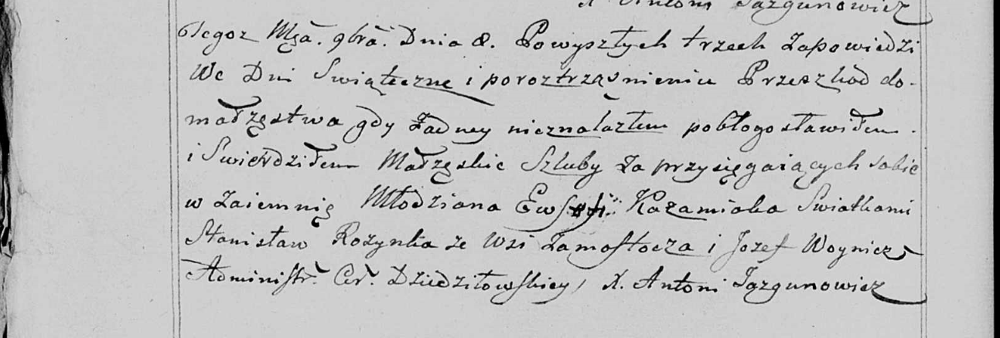

**Розынко Станислав (Rozynkа Stanisław)**

8 ноября 1799 г -- свидетель венчания Стефана Кожемяки с деревни Осово с
Полонеей Войнич с деревни Осово (НИАБ 136-13-920, лист 6об, №6/1799-б
(ориг), НИАБ 136-13-938, лист 248об, №6/1799-б (коп)).

**НИАБ 136-13-920:** Лист 6об. **Метрическая запись №6/1799-б (ориг).**

{width="6.496527777777778in"
height="0.9467541557305337in"}

Дедиловичская Покровская церковь. 8 ноября 1799 года. Метрическая запись
о венчании.

Każamiaka Stefan -- жених, деревня Осовo.

Woyniczowna Połonieja -- невеста, деревня Осовo.

Każamiaka Ewsewi -- свидетель, деревня Замосточье.

Rozynka Stanisław -- свидетель, деревня Замосточье.

Jazgunowicz Antoni -- ксёндз.

**НИАБ 136-13-938:** Лист 248об. **Метрическая запись №6/1799-б (коп).**

(См. тж. НИАБ 136-13-920, лист 6об, №6/1799-б (ориг))

{width="6.496527777777778in"
height="2.2006944444444443in"}

Дедиловичская Покровская церковь. 8 ноября 1799 года. Метрическая запись
о венчании.

Każamiaka Ewsefi \[Stefan\] -- жених, молодой, с деревни \[Осово\].

\[Woyniczowna Połonieja\] -- невеста, с деревни \[Осовo\].

Rozynka Stanisław -- свидетель, с деревни Замосточье.

Woynicz Jozef \[Każamiaka Ewsewi\] -- свидетель, с деревни
\[Замосточье\].

Jazgunowicz Antoni -- ксёндз.
