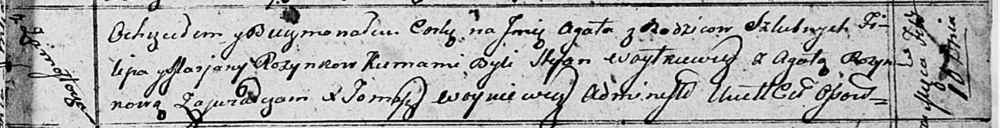

**Розынко Агата Филипова (Rozynkowna Agata)**

10 февраля 1813 г -- крещение (НИАБ 136-13-894, лист 86, №4/1813-р
(ориг)).

**НИАБ 136-13-894:** Лист 86. **Метрическая запись №4/1813-р (ориг).**

{width="6.496527777777778in"
height="0.8367913385826772in"}

Осовская Покровская церковь. 10 февраля 1813 года. Метрическая запись о
крещении.

Rozynkowna Agata -- дочь родителей с деревни Замосточье.

Rozynko Filip -- отец.

Rozynkowa Marjana -- мать.

Woytkiewicz Stefan -- кум.

Rozynkowa Agata -- кума.

Woyniewicz Tomasz -- ксёндз.
