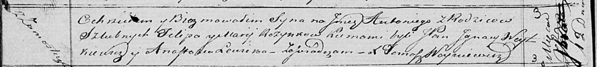

**Розынко Антоний Филипов (Rozynka Antoni)**

12 сентября 1820 г -- крещение (НИАБ 136-13-894, лист 104об, №30/1820-р
(ориг)).

**НИАБ 136-13-894:** Лист 104об. **Метрическая запись №30/1820-р
(ориг).**

{width="6.496527777777778in"
height="0.7368853893263342in"}

Осовская Покровская церковь. 12 сентября 1820 года. Метрическая запись о
крещении.

Rozynko Antoni -- сын родителей с деревни Замосточье.

Rozynko Filip -- отец.

Rozynkowa Marija -- мать.

Woytkiewicz Jgnacy,JP -- кум, шляхтич.

Lewicka Anastazija -- кума.

Woyniewicz Tomasz -- ксёндз.
