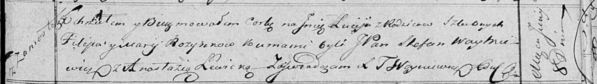

**Розынко Люция Филипова (Rozynkowna Lucija)**

8 июня 1819 г -- крещение (НИАБ 136-13-894, лист 101, №30/1819-р
(ориг)).

**НИАБ 136-13-894:** Лист 101. **Метрическая запись №30/1819-р (ориг).**

Осовская Покровская церковь. 8 июня 1819 года. Метрическая запись о
крещении.

Rozynkowna Lucija -- дочь родителей с деревни Замосточье.

Rozynko Filip -- отец.

Rozynkowa Marija -- мать.

Woytkiewicz Stefan, JP -- кум, шляхтич.

Lewicka Anastazija -- кума.

Woyniewicz Tomasz -- ксёндз.
