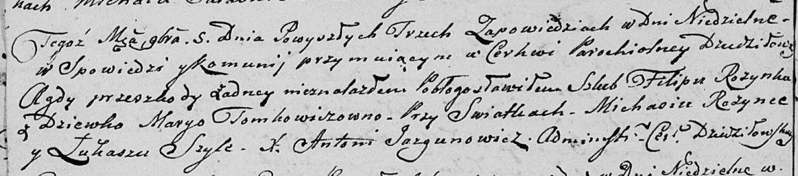
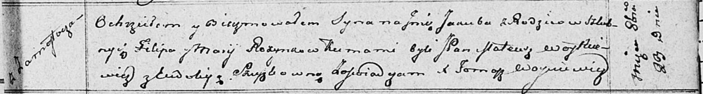
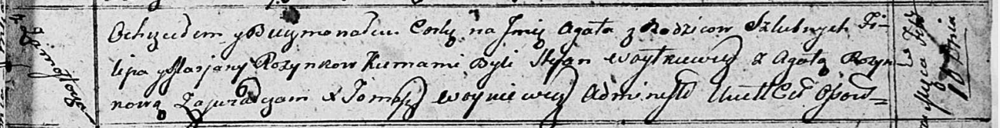
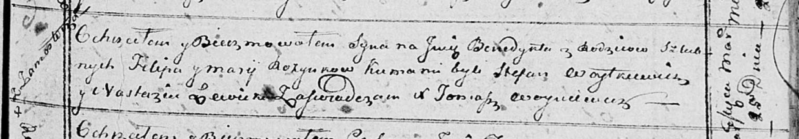

**Розынко Филип (Rozynka Filip)**

5 ноября 1805 г -- венчание с девкой Марго Томкович (НИАБ 136-13-920,
лист 11об, №6/185-б (ориг)).

23 октября 1811 г -- крещение сына Якуба (НИАБ 136-13-894, лист 82,
№51/1811-р (ориг)).

10 февраля 1813 г -- крещение дочери Агаты (НИАБ 136-13-894, лист 86,
№4/1813-р (ориг)).

25 марта 1815 г -- крещение сына Бенедыкта (НИАБ 136-13-894, лист 92,
№17/1815-р (ориг)).

8 июня 1819 г -- крещение дочери Люции (НИАБ 136-13-894, лист 101,
№30/1819-р (ориг)).

12 сентября 1820 г -- крещение сына Антония (НИАБ 136-13-894, лист
104об, №30/1820-р (ориг)).

**НИАБ 136-13-920:** Лист 11об. **Метрическая запись №6/1805-б (ориг).**

Дедиловичская Покровская церковь. 5 ноября 1805 года. Метрическая запись
о венчании.

Rozynka Filip -- жених, с деревни \[Замосточье\].

Tomkowiczowna Margo -- невеста, девка.

Rozynka Michaś -- свидетель.

Szyło Łukasz -- свидетель.

Jazgunowicz Antoni -- ксёндз.

**НИАБ 136-13-894:** Лист 82. **Метрическая запись №51/1811-р (ориг).**

Осовская Покровская церковь. 23 октября 1811 года. Метрическая запись о
крещении.

Rozynko Jakub -- сын родителей с деревни Замосточье.

Rozynko Filip -- отец.

Rozynkowa Marija -- мать.

Woytkiewicz Mateusz, JP -- кум, шляхтич.

Szuszkowna Eudokija -- кума.

Woyniewicz Tomasz -- ксёндз.

**НИАБ 136-13-894:** Лист 86. **Метрическая запись №4/1813-р (ориг).**

Осовская Покровская церковь. 10 февраля 1813 года. Метрическая запись о
крещении.

Rozynkowna Agata -- дочь родителей с деревни Замосточье.

Rozynko Filip -- отец.

Rozynkowa Marjana -- мать.

Woytkiewicz Stefan -- кум.

Rozynkowa Agata -- кума.

Woyniewicz Tomasz -- ксёндз.

**НИАБ 136-13-894:** Лист 92. **Метрическая запись №17/1815-р (ориг).**

Осовская Покровская церковь. 25 марта 1815 года. Метрическая запись о
крещении.

Rozynko Benedykt -- сын родителей с деревни Замосточье.

Rozynko Filip -- отец.

Rozynkowa Marija -- мать.

Woytkiewicz Stefan -- кум.

Lewicka Nastazia -- кума.

Woyniewicz Tomasz -- ксёндз.

**НИАБ 136-13-894:** Лист 101. **Метрическая запись №30/1819-р (ориг).**

Осовская Покровская церковь. 8 июня 1819 года. Метрическая запись о
крещении.

Rozynkowna Lucija -- дочь родителей с деревни Замосточье.

Rozynko Filip -- отец.

Rozynkowa Marija -- мать.

Woytkiewicz Stefan, JP -- кум, шляхтич.

Lewicka Anastazija -- кума.

Woyniewicz Tomasz -- ксёндз.

**НИАБ 136-13-894:** Лист 104об. **Метрическая запись №30/1820-р
(ориг).**

Осовская Покровская церковь. 12 сентября 1820 года. Метрическая запись о
крещении.

Rozynko Antoni -- сын родителей с деревни Замосточье.

Rozynko Filip -- отец.

Rozynkowa Marija -- мать.

Woytkiewicz Jgnacy,JP -- кум, шляхтич.

Lewicka Anastazija -- кума.

Woyniewicz Tomasz -- ксёндз.
