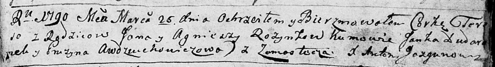

**Розынко Тереса Янова (Rozynkowna Teresa)**

25 марта 1790 г -- крещение (НИАБ 136-13-894, лист 9, №21/1790-р
(ориг)).

**НИАБ 136-13-894:** Лист 9. **Метрическая запись №21/1790-р (ориг).**

Дедиловичская Покровская церковь. 25 марта 1790 года. Метрическая запись
о крещении.

Rozynkowna Teresa -- дочь родителей с деревни Замосточье.

Rozynko Jan -- отец.

Rozynkowa Agniesza -- мать.

Dudaronek Janka - кум.

Awdziuchowichowa Pruzyna - кума.

Jazgunowicz Antonij -- ксёндз.
