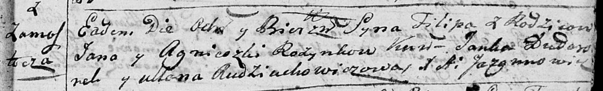

**Розынко Филипп Янов младший (Rozynka Filip)**

22 октября 1794 г -- крещение (НИАБ 136-13-894, лист 23, №48/1794-р
(ориг)), (РГИА 823-2-18, лист 251, №34/1794-р (коп)).

**НИАБ 136-13-894:** Лист 23. **Метрическая запись №48/1794-р (ориг).**

Дедиловичская Покровская церковь. 22 октября 1794 года. Метрическая
запись о крещении.

Rozynka Filip -- сын родителей с деревни Замосточье.

Rozynka Jan -- отец.

Rozynka Agnieszka -- мать.

Dudaronek Janka - кум.

Audziuchowiczowa Ullana - кума.

Jazgunowicz Antoni -- ксёндз.

**РГИА 823-2-18:** Лист 251. **Метрическая запись №34/1794-р (коп).**

Дедиловичская Покровская церковь. 22 октября 1794 года. Метрическая
запись о крещении.

Rozynko Filip -- сын родителей с деревни Замосточье.

Rozynko Jan -- отец.

Rozynkowa Agnieszka -- мать.

Dudaronek Janka -- кум.

Audziuchowiczowa Ullana -- кума.

Jazgunowicz Antoni -- ксёндз.
