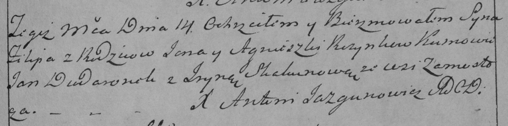

**Розынко Филипп Янов (Rozynka Filip)**

14 ноября 1787 г -- крещение (НИАБ 136-13-894, лист 3, №61/1787-р
(ориг)), (РГИА 823-2-18, лист 235, №32/1787-р (коп)).

**НИАБ 136-13-894:** Лист 3. **Метрическая запись №61/1787-р (ориг).**

{width="6.496527777777778in"
height="0.9970417760279965in"}

Дедиловичская Покровская церковь. 14 ноября 1787 года. Метрическая
запись о крещении.

Rozynko Filip -- сын родителей с деревни Замосточье.

Rozynko Jan -- отец.

Rozynkowa Agnieszka -- мать.

Dudaronek Jan - кум.

Skakunicha Jryna - кума.

Jazgunowicz Antoni -- ксёндз.

**РГИА 823-2-18:** Лист 235. **Метрическая запись №32/1787-р (коп).**

{width="6.496527777777778in"
height="1.6222222222222222in"}

Дедиловичская Покровская церковь. 14 ноября 1787 года. Метрическая
запись о крещении.

Rozynko Filip -- сын родителей с деревни Замосточье.

Rozynko Jan -- отец.

Rozynkowa Agnieszka -- мать.

Dudaronek Jan -- кум.

Skakunowa Jryna - кума.

Jazgunowicz Antoni -- ксёндз.
