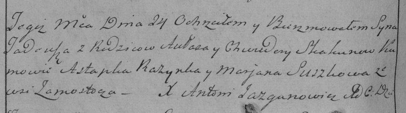

**Скакун Авлас (Skakun Aułas)**

24 августа 1785 г -- крещение сына Тадеуша (РГИА 823-2-18, лист 229об,
№20/1785-р (коп)).

**НИАБ 136-13-894:** Лист 229об. **Метрическая запись №20/1785-р
(коп).**

Дедиловичская Покровская церковь. 24 августа 1785 года. Метрическая
запись о крещении.

Skakun Tadeusz -- сын родителей с деревни Замосточье.

Skakun Aułas -- отец.

Skakunowa Chwiedora -- мать.

Razynka Astapka -- кум.

Suszkowa Marjana - кума.

Jazgunowicz Antoni -- ксёндз.
