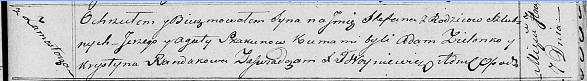

**Скакун Стефан Иосифов (Skakun Stefan)**

7 сентября 1818 г -- крещение (НИАБ 136-13-894, лист 99, №29/1818-р
(ориг)).

**НИАБ 136-13-894:** Лист 99. **Метрическая запись №29/1818-р (ориг).**

Осовская Покровская церковь. 7 сентября 1818 года. Метрическая запись о
крещении.

Skakun Stefan -- сын родителей с деревни Замосточье.

Skakun Jozef -- отец.

Skakunowa Agata -- мать.

Zielonko Adam -- кум.

Randakowa Krystyna -- кума.

Woyniewicz Tomasz -- ксёндз.
