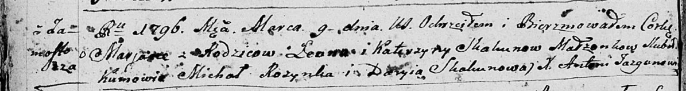

**Скакун Леон (Skakun Leon)**

26 октября 1790 г -- крещение близнецов сына Якуба и дочери Настасьи
(НИАБ 136-13-894, лист 11об, №75/1790-р (ориг)), (РГИА 823-2-18, лист
240об, №28/1790-р (коп)).

9 марта 1796 г -- крещение дочери Марьяны (НИАБ 136-13-894, лист 28об,
№30/1796-р (ориг)).

9 декабря 1812 г -- отпевание, умер в возрасте 60 лет (родился около
1852 г) (НИАБ 136-13-919, лист 24об, №23/1812-у (ориг)).

**НИАБ 136-13-894:** Лист 11об. **Метрическая запись №75/1790-р
(ориг).**

Дедиловичская Покровская церковь. 26 октября 1790 года. Метрическая
запись о крещении.

Skakun Jakub, Skakunowna Nastazya -- сын и дочь родителей с деревни
Замосточье.

Skakun Leon -- отец.

Skakunowa Katerzyna -- мать.

Rozynka Jan - кум.

Skakunowa Palanieja - кума.

Woynicz M\... - кум.

Skakunowa Darya - кума.

Jazgunowicz Antoni -- ксёндз.

**РГИА 823-2-18:** Лист 240об. **Метрическая запись №28/1790-р (коп).**

Дедиловичская Покровская церковь. 29 октября 1790 года. Метрическая
запись о крещении.

Skakun Jakub -- сын родителей с деревни Замосточье.

Skakunowna Nastazya -- дочь родителей с деревни Замосточье.

Skakun Leon -- отец.

Skakunowa Katarzyna -- мать.

Rozynka Jan -- кум.

Skakunowa Pałanieja - кума.

Jazgunowicz Antoni -- ксёндз.

**НИАБ 136-13-894:** Лист 28-об. **Метрическая запись №30/1796-р
(ориг).**

Дедиловичская Покровская церковь. 9 марта 1796 года. Метрическая запись
о крещении.

Skakunowna Marjana -- дочь родителей с деревни Замосточье.

Skakun Leon -- отец.

Skakunowa Katerzyna -- мать.

Rozynka Michał - кум.

Skakunowa Daryia - кума.

Jazgunowicz Antoni -- ксёндз.

**НИАБ 136-13-919:** Лист 24об. **Метрическая запись №23/1812-у
(ориг).**

Осовская униатская церковь. 9 декабря 1812 года. Метрическая запись об
отпевании.

Skakun Leon -- умерший, 60 лет, с деревни Замосточье, похоронен на
кладбище деревни Осово.

Woyniewicz Tomasz -- ксёндз.
