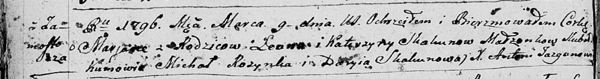

**Скакун Марьяна Леонова (Skakunowna Marjana)**

9 марта 1796 г -- крещение (НИАБ 136-13-894, лист 28об, №30/1796-р
(ориг)).

**НИАБ 136-13-894:** Лист 28-об. **Метрическая запись №30/1796-р
(ориг).**

{width="6.496527777777778in"
height="0.8696456692913386in"}

Дедиловичская Покровская церковь. 9 марта 1796 года. Метрическая запись
о крещении.

Skakunowna Marjana -- дочь родителей с деревни Замосточье.

Skakun Leon -- отец.

Skakunowa Katerzyna -- мать.

Rozynka Michał - кум.

Skakunowa Daryia - кума.

Jazgunowicz Antoni -- ксёндз.
