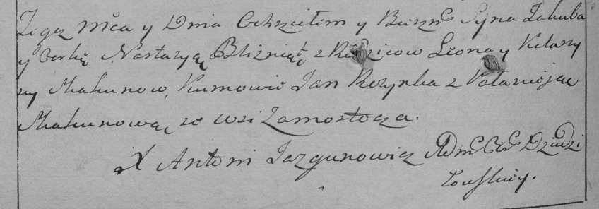

**Скакун Якуб Леонов (Skakun Jakub)**

26 октября 1790 г -- крещение (НИАБ 136-13-894, лист 11об, №75/1790-р
(ориг)), (РГИА 823-2-18, лист 240об, №28/1790-р (коп)).

**НИАБ 136-13-894:** Лист 11об. **Метрическая запись №75/1790-р
(ориг).**

{width="6.496527777777778in"
height="1.10499343832021in"}

Дедиловичская Покровская церковь. 26 октября 1790 года. Метрическая
запись о крещении.

Skakun Jakub, Skakunowna Nastazya -- сын и дочь родителей с деревни
Замосточье.

Skakun Leon -- отец.

Skakunowa Katerzyna -- мать.

Rozynka Jan - кум.

Skakunowa Palanieja - кума.

Woynicz M\... - кум.

Skakunowa Darya - кума.

Jazgunowicz Antoni -- ксёндз.

**РГИА 823-2-18:** Лист 240об. **Метрическая запись №28/1790-р (коп).**

{width="6.496527777777778in"
height="2.267361111111111in"}

Дедиловичская Покровская церковь. 29 октября 1790 года. Метрическая
запись о крещении.

Skakun Jakub -- сын родителей с деревни Замосточье.

Skakunowna Nastazya -- дочь родителей с деревни Замосточье.

Skakun Leon -- отец.

Skakunowa Katarzyna -- мать.

Rozynka Jan -- кум.

Skakunowa Pałanieja - кума.

Jazgunowicz Antoni -- ксёндз.
