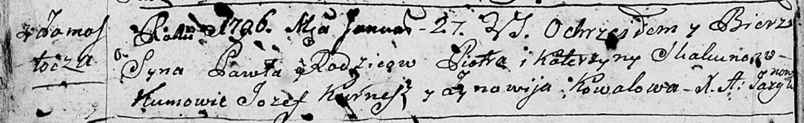

**Скакун Павел Петров (Skakun Paweł)**

27 января 1796 г -- крещение (НИАБ 136-13-894, лист 27об, №13/1796-р
(ориг)).

**НИАБ 136-13-894:** Лист 27об. **Метрическая запись №13/1796-р
(ориг).**

{width="6.496527777777778in"
height="0.9983825459317586in"}

Дедиловичская Покровская церковь. 27 января 1796 года. Метрическая
запись о крещении.

Skakun Paweł -- сын родителей с деревни Замосточье.

Skakun Piotr -- отец.

Skakunowa Katerzyna -- мать.

Kurnesz Jozef - кум.

Kowalowa Zynowija - кума.

Jazgunowicz Antoni -- ксёндз.
