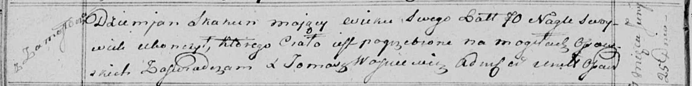

**Скакун Демьян (Skakun Dziemjan)**

25 июня 1815 г -- отпевание, умер в возрасте 70 лет (родился около 1745
г) (НИАБ 136-13-919, лист 29об, №20/1815-у (ориг)).

**НИАБ 136-13-919:** Лист 29об. **Метрическая запись №20/1815-у
(ориг).**

Осовская униатская церковь. 25 июня 1815 года. Метрическая запись об
отпевании.

Skakun Dziemjan -- умер внезапно, 70 лет, с деревни Замосточье,
похоронен на кладбище деревни Осово.

Woyniewicz Tomasz -- ксёндз.
