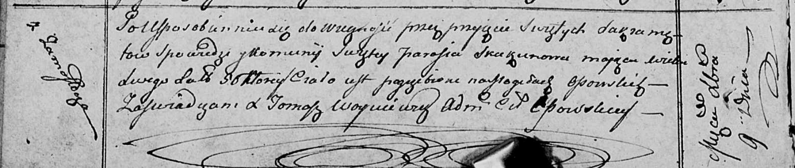

**Скакун Парася (Skakunowa Parasia)**

9 декабря 1812 г -- отпевание, умерла в возрасте 56 лет (родилась около
1756 г) (НИАБ 136-13-919, лист 24об, №24/1812-у (ориг)).

**НИАБ 136-13-919:** Лист 24об. **Метрическая запись №24/1812-у
(ориг).**

Осовская униатская церковь. 9 декабря 1812 года. Метрическая запись об
отпевании.

Skakunowa Parasia -- умершая, 56 лет, с деревни Замосточье, похоронена
на кладбище деревни Осово.

Woyniewicz Tomasz -- ксёндз.
