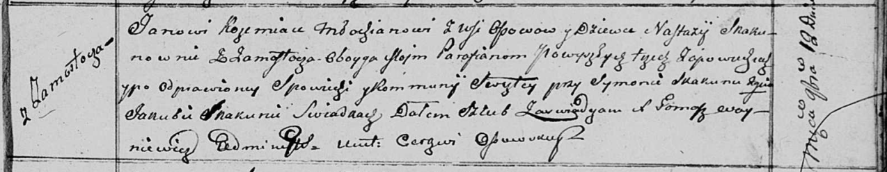

**Скакун Томаш (Skakun Tomasz)**

20 ноября 1810 г -- отпевание, умер в возрасте 40 лет (родился около
1770 г) (НИАБ 136-13-919, лист 22, №10/1810-у (ориг)).

**НИАБ 136-13-919:** Лист 22. **Метрическая запись №10/1810-у (ориг).**

{width="6.496527777777778in"
height="0.9826388888888888in"}

Осовская униатская церковь. 20 ноября 1810 года. Метрическая запись об
отпевании.

Skakun Tomasz -- умерший, 40 лет, с деревни Замосточье, похоронен на
кладбище деревни Осово.

Woyniewicz Tomasz -- ксёндз.
