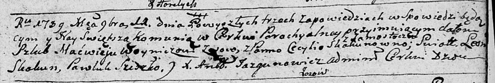

**Скакун (Войнич) Цецылия (Woyniczowa Cecylija z Skakunow)**

11 ноября 1789 г -- венчание с Мацвеем Войничем с деревни Осово (НИАБ
136-13-894, лист 68, №11/1789-б (ориг)).

**НИАБ 136-13-894:** Лист 68. **Метрическая запись №11/1789-б (ориг).**

Дедиловичская Покровская церковь. 11 ноября 1789 года. Метрическая
запись о венчании.

Woynicz Macwiey -- жених, с деревни Осовo.

Skakunowna Cecylija -- невеста, с деревни Замосточье.

Skakun Leon -- свидетель.

Sziszko? Pawluk -- свидетель.

Jazgunowicz Antoni -- ксёндз.
