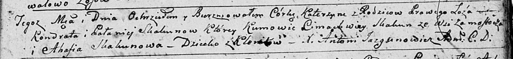
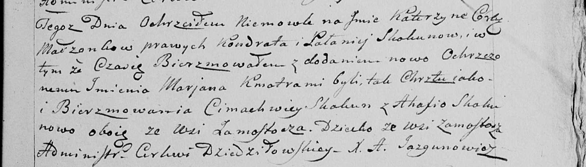

**Скакун Цимахвей (Skakun Cimachwiey)**

20 ноября 1799 г -- крестный отец Катерыны, дочери Скакунов Кондрата и
Паланеи с деревни Клинники (НИАБ 136-13-894, лист 40, №50/1799-р (ориг),
НИАБ 136-13-938, лист 245, №45/1799-р (коп)).

**НИАБ 136-13-894:** Лист 40. **Метрическая запись №50/1799-р (ориг).**

Дедиловичская Покровская церковь. 20 ноября 1799 года. Метрическая
запись о крещении.

Skakunowna Katerzyna -- дочь родителей с деревни Клинники.

Skakun Kondrat -- отец.

Skakunowa Pałanieja -- мать.

Skakun Cimachwiey -- кум, с деревни Замосточье.

Skakunowa Ahafia -- кума.

Jazgunowicz Antoni -- ксёндз.

**НИАБ 136-13-938:** Лист 245. **Метрическая запись №45/1799-р (коп).**

(См. тж. НИАБ 136-13-894, лист 40, №50/1799-р (ориг); РГИА 823-2-18,
лист 273об, №49/1799-р (коп))

Дедиловичская Покровская церковь. 6 ноября 1799 года. Метрическая запись
о крещении.

Skakunowna Katerzyna Marjana -- дочь родителей с деревни Замосточье
\[Клинники\].

Skakun Kondrat -- отец.

Skakunowa Pałanieja -- мать.

Skakun Cimachwiey -- кум, с деревни Замосточье.

Skakunowa Ahafia - кума, с деревни Замосточье.

Jazgunowicz Antoni -- ксёндз.
